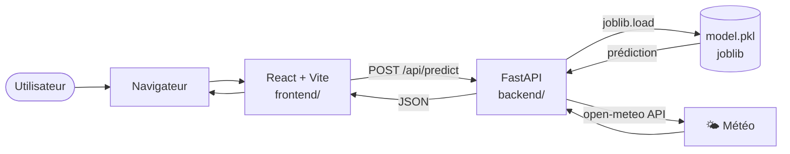

# Architecture du projet F1 Data Project

## Stack et flux

Le projet suit une architecture **monorepo** avec deux services distincts : un frontend React servi par Vite et un backend FastAPI en Python. Ce choix simplifie la gestion du projet en gardant tout le code dans un seul dépôt Git, facilitant la cohérence entre les versions frontend et backend.

**Pourquoi React + FastAPI ?** React (avec TanStack Query) offre une gestion efficace des appels API et du cache côté client, tandis que FastAPI permet d'exposer le modèle ML en Python avec validation automatique des données via Pydantic. Le modèle `model.pkl` vit dans `backend/` et est chargé une seule fois au démarrage du serveur via `joblib`, évitant de le réentraîner à chaque requête.

**Flux principal :** l'utilisateur interagit avec le navigateur → React appelle FastAPI via `POST /api/predict` → FastAPI valide les données, interroge `model.pkl` → retourne la prédiction en JSON → React affiche le résultat.

## Schéma global



## Structure des dossiers

```
f1-data-project/
├── docs/          ← documentation
├── notebook/      ← entraînement du modèle (Colab)
├── backend/       ← API FastAPI + model.pkl
└── frontend/      ← Dashboard React
```

## Stack technique

| Couche | Technologie |
|--------|-------------|
| Frontend | React 18 + Vite + TypeScript |
| Style | Tailwind CSS + shadcn/ui |
| Données | TanStack React Query |
| Graphiques | Recharts |
| Backend | FastAPI + Uvicorn |
| ML | XGBoost + scikit-learn + pandas + joblib |
| Météo | Open-Meteo API (historique + prévisions) |