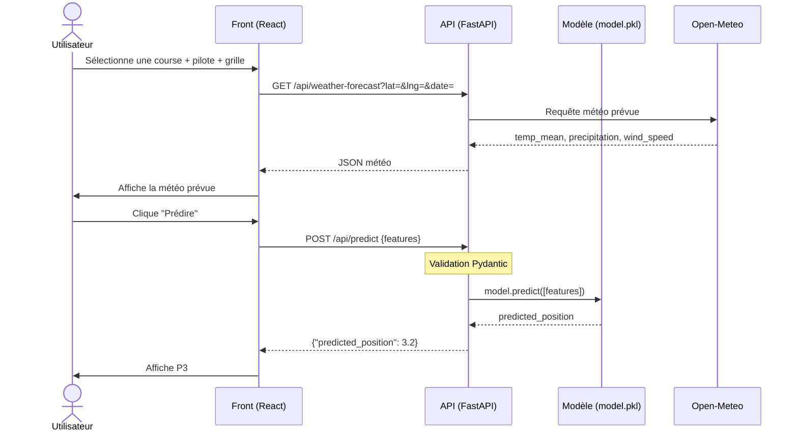

# Diagramme de séquence — Flux de prédiction

## Schéma



## Description des étapes

**Étape 1 — Météo automatique** : dès qu'une course est sélectionnée, le frontend appelle `/api/weather-forecast` avec les coordonnées GPS du circuit et la date. FastAPI interroge Open-Meteo et retourne température, précipitations et vent.

**Étape 2 — Prédiction** : l'utilisateur clique "Prédire". Le frontend envoie toutes les features en JSON via `POST /api/predict`. FastAPI valide le payload avec Pydantic, appelle `model.predict()` sur le modèle XGBoost chargé en mémoire, et retourne la position prédite.

## Contrat de l'endpoint `/api/predict`

```json
{
  "grid": 3,
  "driverId": 830,
  "constructorId": 1,
  "circuitId": 6,
  "year": 2026,
  "quali_position": 2,
  "temp_mean": 22.5,
  "precipitation": 0.0,
  "wind_speed": 15.3
}
```

Réponse :
```json
{
  "predicted_position": 3.2,
  "input": { ... }
}
```