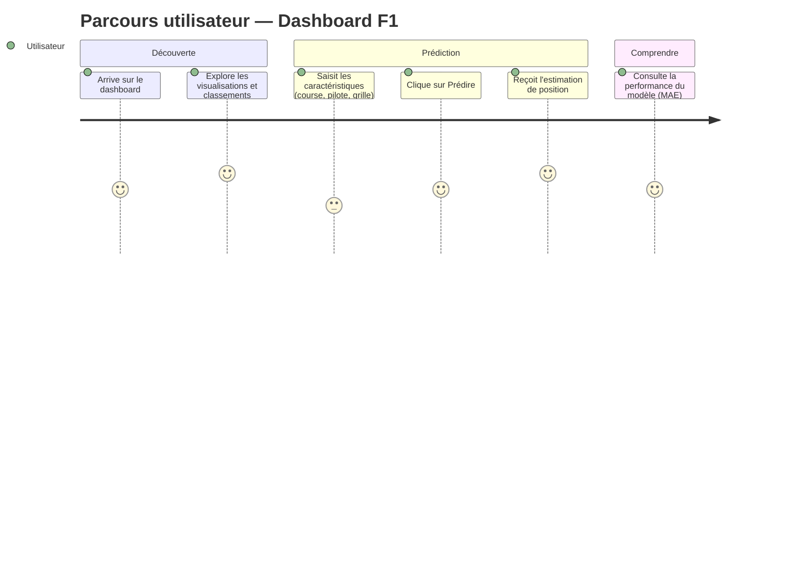

# Parcours utilisateur — Dashboard F1

## Description

L'utilisateur type est un passionné de F1 souhaitant anticiper les résultats d'une course à venir en tenant compte des conditions réelles (grille de départ, météo prévue).

## Schéma Mermaid

## Détail des étapes

**Découverte** — l'utilisateur arrive sur le dashboard et consulte le classement pilotes 2024 ainsi que le prochain Grand Prix 2026.

**Prédiction** — il sélectionne une course à venir, choisit un pilote, renseigne sa position sur la grille et en qualif. La météo prévue est récupérée automatiquement. Il clique sur "Prédire" et obtient la position estimée.

**Comprendre** — il peut consulter les métriques du modèle (MAE ~4.8 positions) pour évaluer la fiabilité de la prédiction.