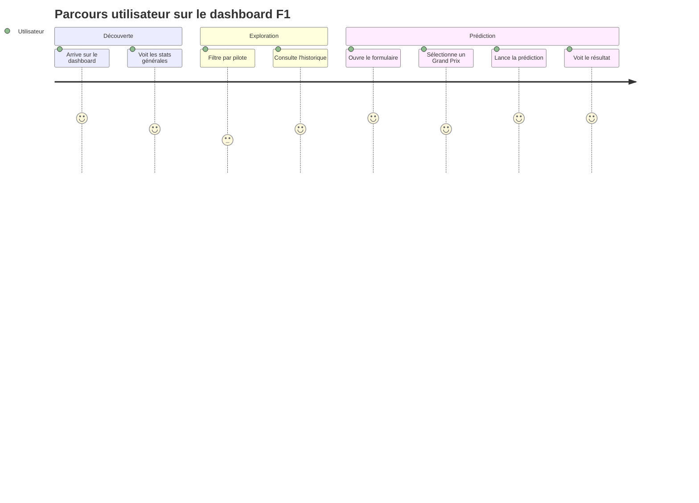

# User Journey — Dashboard F1

## Persona
Passionné de F1 qui veut anticiper les résultats d'une course.

## Parcours type

1. **Arrivée sur le dashboard**
   → Voit les derniers résultats de courses en graphique

2. **Exploration**
   → Filtre par pilote ou par saison
   → Consulte les statistiques historiques

3. **Prédiction**
   → Sélectionne un Grand Prix + une grille de départ
   → Lance la prédiction
   → Voit le classement prédit avec les probabilités

## Pages / vues
- `/` — Dashboard général (stats, graphiques)
- `/predict` — Formulaire de prédiction

